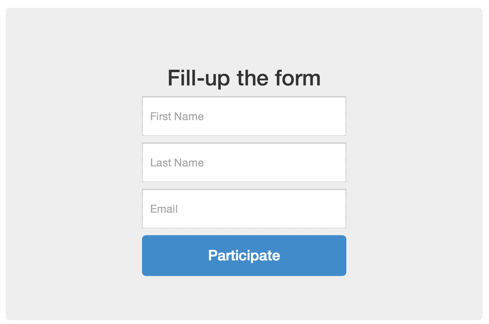

# Participant Signup

**Participant Signup** is a simple Django app for rendering form that sends participant entry on events/contest.



## Quick start

### 1. Add "apps.participant_signup" to your `INSTALLED_APPS` setting like this:
	
```
#!python
INSTALLED_APPS = (
	...
	'apps.participant_signup',
)
```

### 2. To test locally, open a new terminal then run this command (Python built-in SMTP server listening on port 1025 of localhost), or if you are using other SMTP server just skip this part:

```
#!python
    python -m smtpd -n -c DebuggingServer localhost:1025
```

### 3. For meta-world testing, set Email configuration on settings.py:

```
#!python
EMAIL_HOST = 'localhost'
EMAIL_PORT = 1025
```

### 4. For real-world testing, set Email configuration on settings.py (in this example i'm using GMail SMTP server):

```
#!python
EMAIL_HOST = 'smtp.gmail.com'
EMAIL_HOST_USER = 'your_email@gmail.com'
EMAIL_HOST_PASSWORD = 'youremailpassword'
EMAIL_PORT = 587
EMAIL_USE_TLS = True
```

### 5. Include the faqs URLconf in your project `urls.py` like this:

```
#!python
    url(r'^participant-signup/', include('apps.participant_signup.urls')),
```

### 6. Run `python manage.py syncdb` to create the participant_signup models.

### 7. Run `python manage.py runserver` then Visit `http://127.0.0.1:8000/participant-signup/` to view the Participant Signup form.

### 8. To check Participant(s), visit Admin `http://127.0.0.1:8000/participant-signup/admin/`